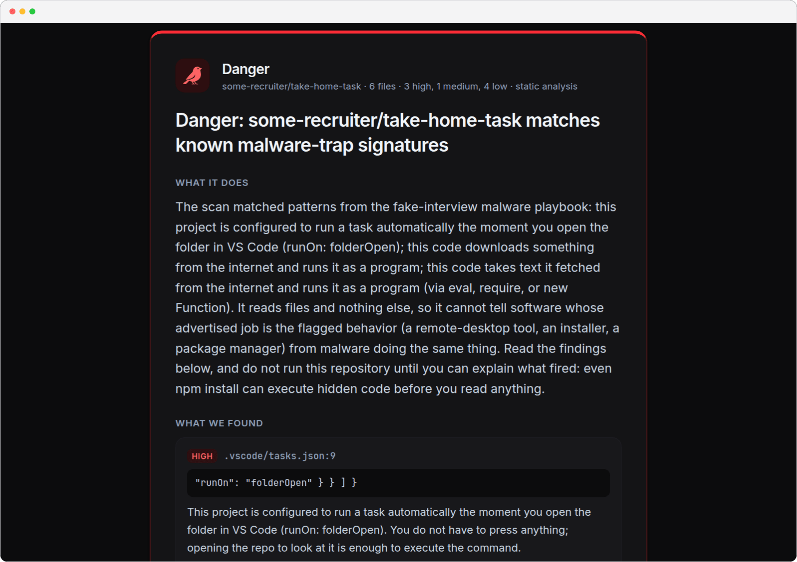
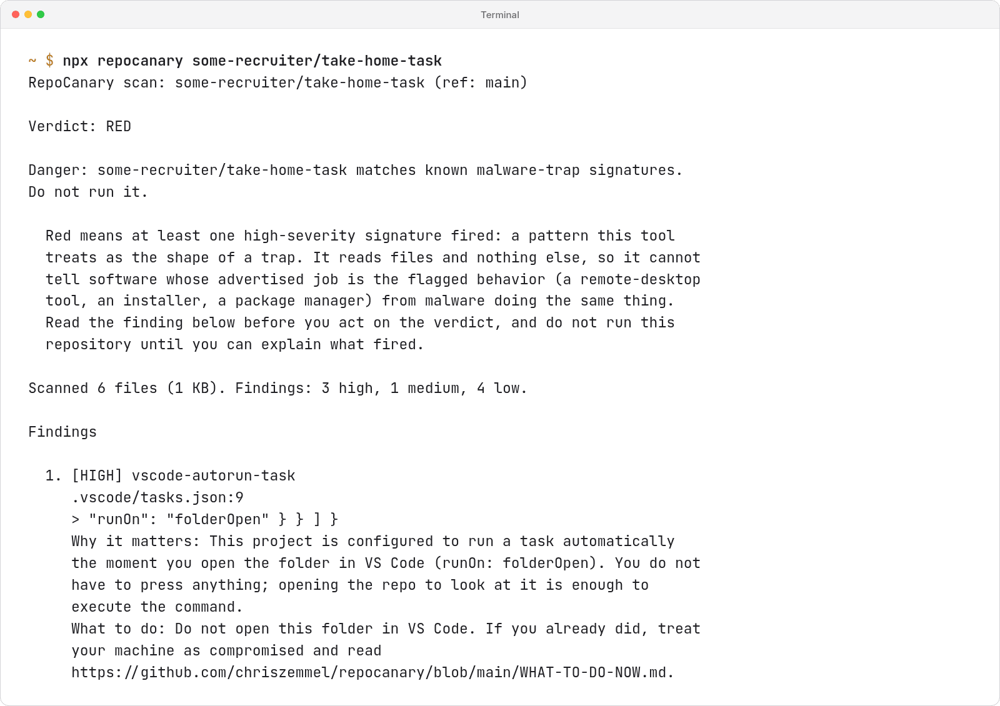
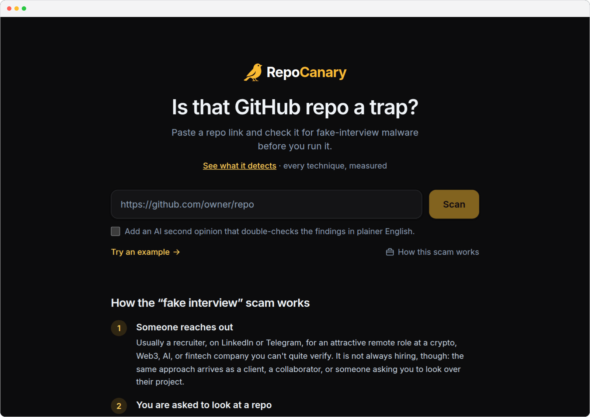
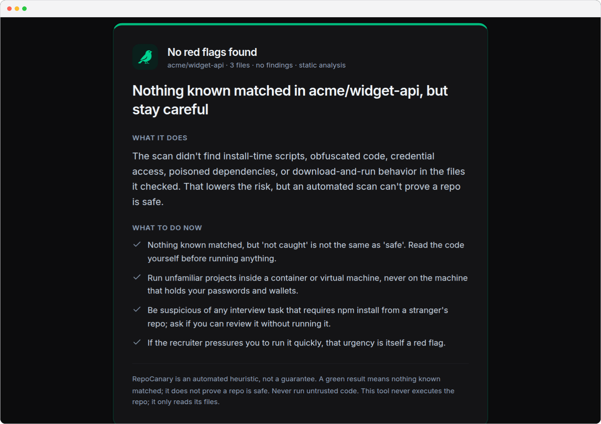
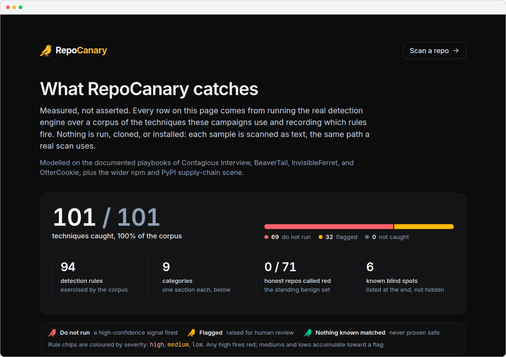
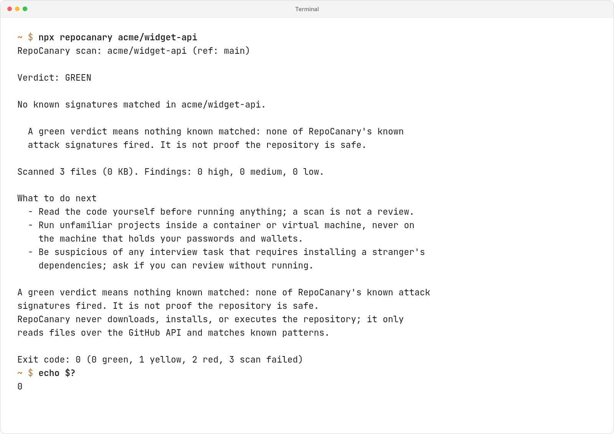
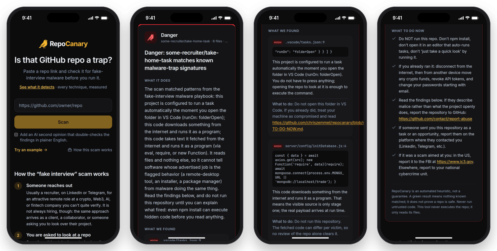
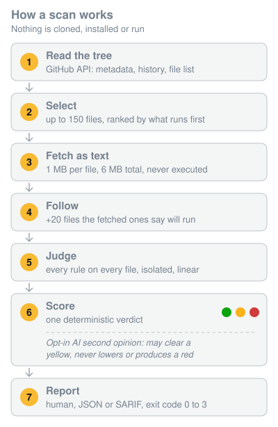
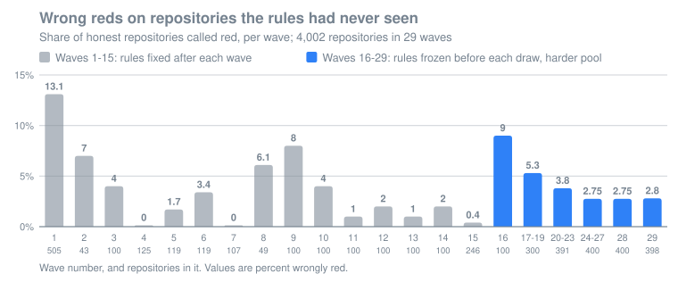
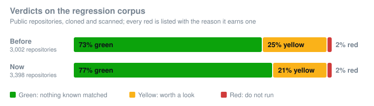

<p align="center">
  
</p>

<p align="center">
  <strong>Is that GitHub repo a trap?</strong><br>
  Check a repository for the known signatures of fake-job-interview malware,
  in seconds, for free, without downloading or running any of its code.
</p>

<p align="center">
  <a href="https://www.npmjs.com/package/repocanary"></a>
  <a href="https://github.com/chriszemmel/repocanary/actions/workflows/ci.yml"></a>
  <a href="THREAT-COVERAGE.md"></a>
  <a href="package.json"></a>
  <a href="LICENSE"></a>
</p>

<p align="center">
  <a href="https://repocanary.com"><b>repocanary.com</b></a> ·
  <a href="#usage">Usage</a> ·
  <a href="#how-it-works">How it works</a> ·
  <a href="#results">Results</a> ·
  <a href="#in-github-actions">GitHub Action</a> ·
  <a href="THREAT-COVERAGE.md">Threat coverage</a>
</p>

<p align="center">
  <picture>
    <source media="(prefers-color-scheme: dark)" srcset="docs/screenshots/web-red-dark.png" />
    
  </picture>
</p>

```bash
npx repocanary some-recruiter/take-home-task
```

No install, no account, no telemetry. Node 20 or newer. MIT licensed. The
same engine runs on the website, [repocanary.com](https://repocanary.com),
for anyone without a terminal.

<p align="center">
  <picture>
    <source media="(prefers-color-scheme: dark)" srcset="docs/screenshots/cli-red-dark.png" />
    
  </picture>
</p>

Every finding names the file and line, says why it matters in plain
language, and says what to do next. A green result is worded "nothing known
matched", never "safe", and a scan that could not complete never pretends
to be one that did.

## How to read a result

You do not need to understand the findings to act on the color.

- **Red**: a high-severity signature fired, a pattern RepoCanary treats as
  the shape of a trap. Do not run it, do not install it, and do not open it
  in an editor that runs tasks automatically. If you already did, go straight
  to [WHAT-TO-DO-NOW.md](WHAT-TO-DO-NOW.md). The tool reads files and nothing
  else, so it cannot tell software whose advertised job is the flagged
  behavior (a remote-desktop tool, an installer, a package manager) from
  malware doing the same thing. Read the finding before you act on the color.
- **Yellow**: something looks suspicious but has an honest explanation in
  some projects. Do not run it until someone you trust has read the flagged
  lines. The report says exactly which lines.
- **Green**: nothing RepoCanary knows about matched. That lowers the risk;
  it does not prove the repository is safe, and the report says so.

**Never used a terminal?** Open [repocanary.com](https://repocanary.com),
paste the repository link, and read the same result there. Nothing is
downloaded to your computer either way.

## Screenshots

<table>
  <tr>
    <td width="50%" valign="top">
      <picture>
        <source media="(prefers-color-scheme: dark)" srcset="docs/screenshots/web-home-dark.png" />
        
      </picture>
      <p align="center"><sub><b>Paste a link</b>: no account, nothing downloaded to your machine</sub></p>
    </td>
    <td width="50%" valign="top">
      <picture>
        <source media="(prefers-color-scheme: dark)" srcset="docs/screenshots/web-green-dark.png" />
        
      </picture>
      <p align="center"><sub><b>Green</b>: worded as "nothing known matched", never "safe"</sub></p>
    </td>
  </tr>
  <tr>
    <td width="50%" valign="top">
      <picture>
        <source media="(prefers-color-scheme: dark)" srcset="docs/screenshots/web-coverage-dark.png" />
        
      </picture>
      <p align="center"><sub><b>Threat coverage</b>: every technique, measured, with the rules that fire</sub></p>
    </td>
    <td width="50%" valign="top">
      <picture>
        <source media="(prefers-color-scheme: dark)" srcset="docs/screenshots/cli-green-dark.png" />
        
      </picture>
      <p align="center"><sub><b>CLI</b>: the same verdict, and an exit code a pipeline can gate on</sub></p>
    </td>
  </tr>
</table>

<p align="center">
  
</p>

<p align="center"><sub>Every screenshot is the real engine on two example repositories, regenerated by <code>npm run screenshots</code>.</sub></p>

## The attack

Someone sends you a repository and asks you to run it or just open it: a
recruiter with a take-home task, a "client", a collaborator who wants a second
opinion. The payload sits where it runs before you have read anything: an
npm `postinstall` script, an obfuscated config file, a poisoned lockfile
entry, or, with no install step at all, a VS Code task that runs when the
folder opens, an MCP server your AI editor starts by itself, an agent hook or
a dev container. It steals browser passwords, SSH keys, cloud tokens and
crypto wallets.

Campaigns like "Contagious Interview", attributed to North Korean state
actors, have run this against thousands of developers, and the tooling is now
copied by ordinary criminals. RepoCanary is for the person that repository
was sent to: run it before the code reaches your editor or your terminal.

## Why pointing it at malware is safe

RepoCanary never clones, installs, executes, evaluates or imports the target.
It reads a bounded set of files as plain text through the GitHub API (at most
150 selected files plus 20 they say will run, about 6 MB) and matches patterns against them. Scanning a
malicious repository is as dangerous as reading it in your browser. The only
endpoint it contacts is `api.github.com`, plus your AI provider if you opt in
with `--ai`. No accounts, no database, no telemetry.

## How it works

<p align="center">
  
</p>

1. **Select.** The tree is ranked by where a trap has to live to fire before
   anyone reads it: install hooks, editor and agent autoruns, lockfiles,
   build scripts. Each kind has a quota so none can spend the whole budget,
   and ordinary source fills what is left.
2. **Follow.** A `postinstall` that runs `node scripts/setup.js`, an
   `npm run` chain, a `bin` entry, a VS Code task: whatever a file says will
   execute is fetched on a reserved budget of its own, so a large repository
   cannot crowd out the one file that decides the verdict.
3. **Judge.** Every rule runs on every file in isolation. A rule that throws
   on crafted input costs that file's findings and is reported, never the
   scan. Cost is held linear in file size, measured on hostile shapes at the
   per-file cap.
4. **Score.** Severity decides the color; weak context signals (a new
   account, a single-commit history) can raise a caution but never a red on
   their own. The same input produces the same bytes out.

## What it checks

The full catalog, with the rules that fire on each technique, is
[THREAT-COVERAGE.md](THREAT-COVERAGE.md), generated from the engine so it
never drifts from the code.

- **Install-time execution**: every npm lifecycle script and the local files
  it runs, `setup.py` and Python build backends, Rust `build.rs`, Gradle,
  Maven, Composer, Ruby gem builds, Makefiles and Dockerfiles, Jupyter cells.
- **Open-time execution**: VS Code `folderOpen` tasks and linter paths, MCP
  server configs, Claude Code hooks, dev containers, direnv, Emacs and Neovim
  project files.
- **Poisoned dependencies**: lockfile entries off the registry, git and URL
  dependencies, `overrides` redirects, npm aliases, committed `.npmrc`
  registries, typosquats and known-malicious package names.
- **Theft**: code that reads browser credential stores, wallets, SSH keys and
  cloud credentials, posts the environment out, or phishes the login password.
- **Loaders and persistence**: download-and-execute in all its shell and code
  forms, encoded PowerShell, Windows living-off-the-land tools, ClickFix
  READMEs, cron jobs, launch agents, Run keys and shell startup files.
- **Obfuscation, measured**: entropy, encoded-blob density, obfuscator
  toolmarks, code hidden past the right edge of the screen, invisible and
  bidirectional characters, homoglyphs.
- **Campaign fingerprints**: known command-and-control paths, ports, backdoor
  handlers and dead-drop resolvers.
- **Context** (never more than a caution on its own): brand-new accounts,
  single-burst histories, crypto lure themes, install-first READMEs.

## What it cannot catch

RepoCanary matches known signatures in files. Payloads fetched only at run
time from clean-looking code, a compromised dependency that still resolves
normally from the registry, and instructions delivered over chat instead of
committed to the repository can all pass green. Neither can it judge a
`CLAUDE.md` or `AGENTS.md` that asks your coding agent, in plain language, to
do something harmful; it catches the mechanical tricks (hidden text, tag
characters, a link carrying a secret), not intent. [THREAT-MODEL.md](THREAT-MODEL.md)
explains each limit and how someone would exploit it.

**Green means nothing known matched. It does not mean the repository is
safe.** Every report says exactly that.

## Results

Measured on 4,002 repositories the rules had never seen and a regression
corpus of 3,408 public projects. Details and method in
[BENCHMARK.md](BENCHMARK.md).





| What                                            | Result                                    |
| ----------------------------------------------- | ----------------------------------------- |
| Wrong reds on unseen repositories, rules frozen | 2.75% over the last 1,198                 |
| Live traps found in the wild while measuring    | 19 repositories, 13 of them one account's |
| Documented attack techniques flagged            | 101 of 101 (69 red, 32 yellow)            |
| Known blind spots, kept as samples that pass    | 6                                         |

About one honest repository in 36 still comes out red; each known one is
listed with its reason in [`scripts/corpus/expected-red.txt`](scripts/corpus/expected-red.txt). The 101 techniques are a regression guard, not a
detection rate: an honest detection rate needs malware written by someone
else, and BENCHMARK.md says so.

RepoCanary reports its own repository as red, because a signature scanner
has to contain its signatures and its test fixtures are malware-shaped. An
exemption for that would be an evasion path, so there is none.

## Usage

```bash
npx repocanary owner/repo
npx repocanary https://github.com/owner/repo --ref dev
npx repocanary owner/repo --json > report.json
npx repocanary owner/repo --sarif > repocanary.sarif
```

| Exit code | Meaning                                                           |
| --------- | ----------------------------------------------------------------- |
| 0         | Green: nothing known matched (not proof of safety)                |
| 1         | Yellow: have someone review the flagged lines before running      |
| 2         | Red: known trap signatures matched; do not run it                 |
| 3         | The scan could not complete; never reported as green              |

**Set `GITHUB_TOKEN`.** GitHub allows 60 anonymous requests an hour and a
scan can use up to 175, so any fine-grained token with public repository
read access is effectively required:
`GITHUB_TOKEN=github_pat_... npx repocanary owner/repo`.

### Optional AI second opinion

`--ai` sends the findings (file paths, redacted snippets, reasons, and public
repository metadata) to a language model with your own key. Nothing from your
machine is sent. Providers, tried in this order: Gemini (`GEMINI_API_KEY`,
free tier), Groq (`GROQ_API_KEY`, free tier), OpenAI (`OPENAI_API_KEY`) and
Anthropic (`ANTHROPIC_API_KEY`); `--ai-provider` forces one, and
`<PROVIDER>_MODEL` overrides the model. With no key set, RepoCanary offers to
take a pasted one, hidden while typed and never written to disk. Keys are
never accepted as command-line flags.

The model can raise a green to yellow or clear a yellow. It can never lower a
red and never produce one; that is enforced in code. Treat its answer as a
second opinion on the flagged lines, not a verdict.

### JSON and SARIF

`--json` emits a versioned document (`schemaVersion: 1`) with `verdict`,
`exitCode`, `verdictMeaning`, `findings` (each with `id`, `severity`, `file`,
`line`, `snippet`, `why`, `next`), `notes` for anything the scan could not
read, and `stats`. `stats.findings` is the full count; the `findings` array
stops at 200. `--sarif` emits SARIF 2.1.0 for GitHub code scanning. A scan
that could not complete still writes a document in either format, with
`verdict: "error"` and an `error` object (SARIF: `executionSuccessful: false`),
so a consumer parsing stdout never gets zero bytes.

## Three surfaces, one engine

The CLI, the website at [repocanary.com](https://repocanary.com)
and a GitHub Action all run the same detector from `src/`, so a rule behaves
the same everywhere.

### In GitHub Actions

`action.yml` wraps the same CLI, so a workflow can scan a repository before
anyone on the team runs it:

```yaml
- uses: chriszemmel/repocanary@<full commit SHA> # v1.0.0
  with:
    repository: some-recruiter/take-home-task
    fail-on: red
    sarif-file: repocanary.sarif
```

Pin the full commit SHA of a release rather than its tag. A tag can be moved,
and the action runs on your runner with your token.

| Input          | Default                | Meaning                                                                                                                    |
| -------------- | ---------------------- | -------------------------------------------------------------------------------------------------------------------------- |
| `repository`   | the current repository | The `owner/repo` to scan                                                                                                   |
| `ref`          | see its meaning        | Branch, tag, or commit to scan. Unset, it is the triggering commit for this repository and the default branch of any other |
| `fail-on`      | `red`                  | Fail the step at this verdict or worse (`red`, `yellow`, `never`). A scan that could not complete fails under all three    |
| `sarif-file`   | none                   | Write a SARIF report to this path                                                                                          |
| `github-token` | `github.token`         | Used for API requests, to raise the rate limit                                                                             |

The step sets one output, `verdict`: `green`, `yellow`, `red`, or `error`.
An `error` fails the step under every `fail-on` setting, because a check that
could not look must not pass like one that found nothing. Follow it with
`github/codeql-action/upload-sarif` to put findings in the Security tab.

### In a README

The website serves the verdict as a badge, so a project can show what
RepoCanary says about it next to its CI status:

```markdown
[](https://repocanary.com/?repo=owner/repo)
```

It reads "no known traps", "flagged", "do not run", or "unavailable" when the
scan could not run, which is never drawn as green. Verdicts are cached for a
day.

### Hosting the site yourself

```bash
npm install && npm run build:web
NEXT_PUBLIC_SITE_URL=https://your.domain GITHUB_TOKEN=... npm run start:web
```

No database, no queue. On a platform that builds from a subdirectory (Vercel:
Root Directory `web`), allow files outside it, since the app imports `../src`.

## If you already ran a suspicious repo

Stop and read [WHAT-TO-DO-NOW.md](WHAT-TO-DO-NOW.md). The order of the steps
matters, and the first one is to disconnect the machine.

## Engineering

A scanner for hostile input has to be hostile-input-proof itself, and a
security verdict is only worth what stops it from quietly changing. Each
guarantee below is checked by named tests:

| Guarantee                                                       | Enforced by                                                                                            |
| --------------------------------------------------------------- | ------------------------------------------------------------------------------------------------------ |
| Never executes the target; no `child_process`, no `eval`        | [`test/invariants.test.js`](test/invariants.test.js)                                                   |
| Only `api.github.com` and the opt-in AI host are ever contacted | [`test/invariants.test.js`](test/invariants.test.js)                                                   |
| The AI pass can never lower a red or produce one                | [`test/ai.test.js`](test/ai.test.js), [`test/verdict.test.js`](test/verdict.test.js)                   |
| Every failure exits 3; nothing that did not look reports green  | [`test/cli.test.js`](test/cli.test.js), [`test/action.test.js`](test/action.test.js)                   |
| Scan cost is linear; a 1 MB file built to be slow stays fast    | [`test/redos.test.js`](test/redos.test.js), [`test/hostile-input.test.js`](test/hostile-input.test.js) |
| Same repository, same bytes out, whatever ran before            | [`test/scan.test.js`](test/scan.test.js), [`test/golden/`](test/golden)                                |
| Terminal output cannot be spoofed by control or bidi characters | [`test/textutil.test.js`](test/textutil.test.js), [`test/report.test.js`](test/report.test.js)         |
| A loosened rule never loses a confirmed catch                   | `npm run guard`: every sample, every documented evasion, every confirmed red                           |

750+ tests run offline in about 25 seconds with no network and nothing to
install; line coverage of `src/` is above 95%. The threat catalog is
generated from the rules, so documentation and detection cannot drift, and
CI fails if they do. The npm package ships with provenance through Trusted
Publishing, and no publishing token exists anywhere.

```bash
git clone https://github.com/chriszemmel/repocanary
cd repocanary
npm test        # offline, nothing to install
npm run lint
```

Plain Node 20+, zero runtime dependencies. Start with `src/scan.js` for the
pipeline, `src/heuristics.js` for which rules a file gets, and
`src/signatures.js` for the technique tables. See
[CONTRIBUTING.md](CONTRIBUTING.md) to add a rule and [SECURITY.md](SECURITY.md)
to report a vulnerability.

The most useful contribution is a repository this tool got wrong, in either
direction. Open an issue with the URL; a fixture that reproduces it is even
better.

## Support

RepoCanary is free, with no account, no tracking and no paid tier, and it
will stay that way. If it saved you a bad afternoon, you can say thanks at
[nimimo.com/@chris](https://nimimo.com/@chris). Nothing in the tool changes
either way.

## License

MIT. See [LICENSE](LICENSE).

The website is run by Chris Zemmel, Germany. Its
[legal notice](https://repocanary.com/legal-notice) and
[privacy policy](https://repocanary.com/privacy) say who is
responsible and what a scan processes: no account, no cookies, no analytics,
and nothing written to disk.
